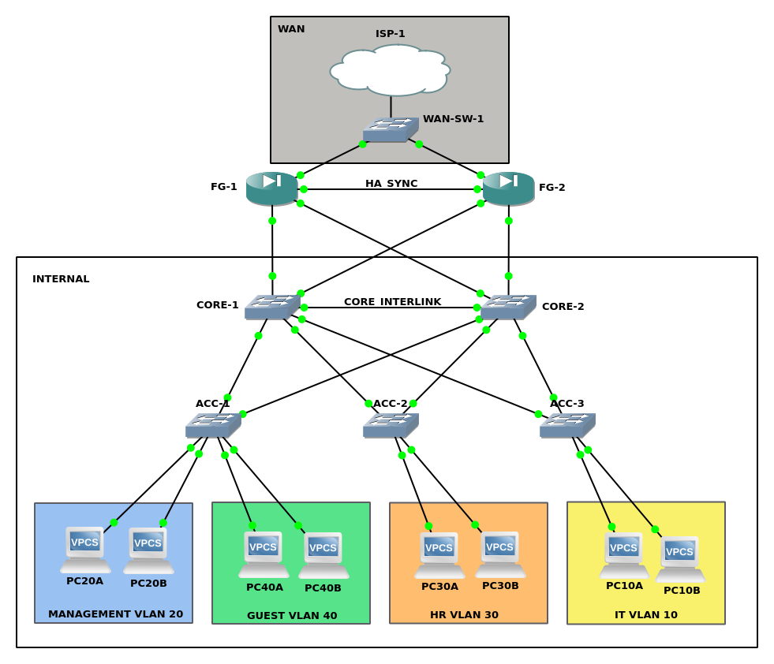

# Resilient Campus Architecture – Hierarchical Design with Core & Firewall HA

## Executive Summary

This version evolves the baseline segmented campus network (V1) into a **multi-tier hierarchical architecture** engineered for redundancy, loop prevention, and rapid failover.

The topology implements:

* Collapsed Core/Distribution layer
* HSRP gateway redundancy
* LACP inter-core backbone aggregation
* Rapid-PVST+ spanning-tree optimization
* Cross-linked ("X" mesh) access uplinks
* FortiGate Active–Passive High Availability

The objective is to eliminate single points of failure (SPOF) within the defined design scope while maintaining deterministic traffic flow and measurable convergence behavior.

All redundancy mechanisms were validated through controlled failure simulations.

---

## Architectural Model



### Collapsed Core/Distribution Layer

The design follows a hierarchical campus model using a **collapsed Core/Distribution layer**, where:

* Core switches perform Layer 3 routing
* HSRP provides default gateway redundancy
* ACL enforcement remains at the SVI level
* The firewall enforces north–south policy

This approach simplifies topology while maintaining separation of roles.

---

## Core Infrastructure & Redundancy

### Layer 3 Gateway Redundancy – HSRP

* One HSRP group per VLAN
* Virtual IP (.1) used as consistent default gateway
* CORE-1 configured as Primary (higher priority)
* CORE-2 configured as Secondary
* Preemption enabled
* Default HSRP timers (no tuning applied)

**Measured Result:**
During CORE-1 shutdown, 5 ICMP packets were lost before CORE-2 assumed active gateway status.

This reflects default HSRP hello/hold convergence timing.

Outcome:
End hosts retained the same gateway IP and required no reconfiguration.

---

### Inter-Core Link Aggregation – LACP (802.3ad)

The `CORE_INTERLINK` uses LACP to bundle multiple physical links into a single Port-Channel.

Benefits:

* Increased backbone bandwidth
* Link-level redundancy
* Faster convergence compared to single-link backbone
* Logical consistency between cores

If one physical link fails, traffic continues across remaining members without routing disruption.

---

## Layer 2 Loop Prevention – The “X” Mesh Design

### Design Choice

An "X" mesh topology was selected to maximize physical path diversity between the Access and Core layers.

Each Access switch maintains uplinks to both CORE-1 and CORE-2.

This introduces intentional Layer 2 loops that must be controlled logically.

---

### Spanning Tree Strategy – Rapid-PVST+

Rapid-PVST+ was implemented to:

* Prevent switching loops
* Provide rapid convergence
* Maintain deterministic forwarding paths

Root bridge configuration:

* CORE-1: Primary Root (Priority 4096)
* CORE-2: Secondary Root (Priority 8192)

---

### Deterministic Traffic Flow

This configuration ensures:

* Primary uplinks are actively forwarding
* Secondary cross-links remain in Blocking (hot-standby) state
* Sub-second transition to Forwarding if a primary link fails

The result is:

* Loop-free topology
* Predictable forwarding paths
* Fast recovery during link failure

No Multi-Chassis EtherChannel (MEC) was used. Spanning Tree was deliberately optimized instead.

---

## Perimeter Redundancy – FortiGate HA

* Active–Passive configuration
* Configuration synchronization enabled
* Session synchronization enabled
* Shared virtual MAC
* Redundant Layer 3 adjacency to both core switches

**Measured Result:**
During Active firewall failure, 1 ICMP packet was lost before the Passive unit assumed control.

Session state was preserved.

Core routing configuration remained unchanged during firewall transition.

---

## Routing Model

### Core Switches

* Static default route → Firewall HA internal address

### Firewall Cluster

* Static summary route → 10.10.0.0/16 toward internal cores

Static routing was intentionally retained to:

* Isolate redundancy behavior from dynamic routing convergence
* Maintain deterministic traffic paths
* Provide controlled HA testing environment

---

## Failure Scenario Validation

All failover tests were performed under continuous traffic monitoring.

### Test 1 – Core Primary Failure (HSRP)

Observed:

* 5 ICMP packets lost
* HSRP state transition completed successfully
* Traffic resumed automatically

Location:
`failover-tests/test-1-hsrp-core-failure/`

---

### Test 2 – Active Firewall Failure

Observed:

* 1 ICMP packet lost
* Session synchronization preserved state
* Internet connectivity maintained

Location:
`failover-tests/test-2-firewall-active-failure/`

---

### Test 3 – Uplink / Trunk Failure

Observed:

* Rapid-PVST+ reconverged
* Blocked cross-link transitioned to Forwarding
* No sustained blackholing

Location:
`failover-tests/test-3-trunk-link-failure/`

---

### Test 4 – Dual Failure Scenario

Simultaneous:

* Core primary failure
* Active firewall failure

Objective:
Validate layered redundancy independence and prevent cascading outage.

Location:
`failover-tests/test-4-dual-failure-scenario/`

---

## Observed Convergence Metrics

| Event Type           | Packet Loss                | Impact                   |
| -------------------- | -------------------------- | ------------------------ |
| HSRP Core Failover   | 5 packets                  | Brief interruption       |
| Firewall HA Failover | 1 packet                   | Near-seamless            |
| STP Uplink Failover  | Minimal                    | Sub-second reconvergence |
| Dual Failure         | (document measured result) | (document impact)        |

All tests conducted using default protocol timers.

---

## Scalability & Security

### VLAN Segmentation

Traffic remains isolated by functional zones:

* Management
* HR
* Guest
* Infrastructure

Segmentation reduces broadcast domains and limits lateral movement.

### Growth Potential

The X-mesh design allows additional Access switches to integrate without re-engineering Core logic.

HSRP, STP root roles, and LACP backbone design remain consistent.

---

## Design Tradeoffs

* Static routing limits multi-site scalability
* Default HSRP timers increase failover detection time
* Spanning Tree introduces blocking links (non-active redundancy)
* MEC not implemented to maintain design simplicity
* HA increases operational complexity

Redundancy reduces outage probability but increases configuration responsibility.

---

## Repository Structure

```
v2-resilient-core-edge-ha-firewall/
├── README.md
├── topology/
│   └── topology.png
├── configs/
│   ├── core/
│   │   ├── core1.txt
│   │   └── core2.txt
│   ├── firewall/
│   │   ├── fg1.txt
│   │   └── fg2.txt
│   └── access/
│       ├── access-sw1.txt
│       ├── access-sw2.txt
│       └── access-sw3.txt
├── failover-tests/
│   ├── test-1-hsrp-core-failure/
│   ├── test-2-firewall-active-failure/
│   ├── test-3-trunk-link-failure/
│   └── test-4-dual-failure-scenario/
├── docs/
│   ├── design-decisions.md
│   ├── ip-addressing-plan.md
│   ├── failover-flow-diagram.png
│   ├── troubleshooting.md
│   └── lessons-learned.md
```

---

## Architectural Evolution

Future enhancements may include:

* DMZ perimeter segmentation
* Dual ISP integration
* Dynamic routing (OSPF) for faster convergence
* Multi-Chassis EtherChannel (MEC)
* Automated configuration validation
