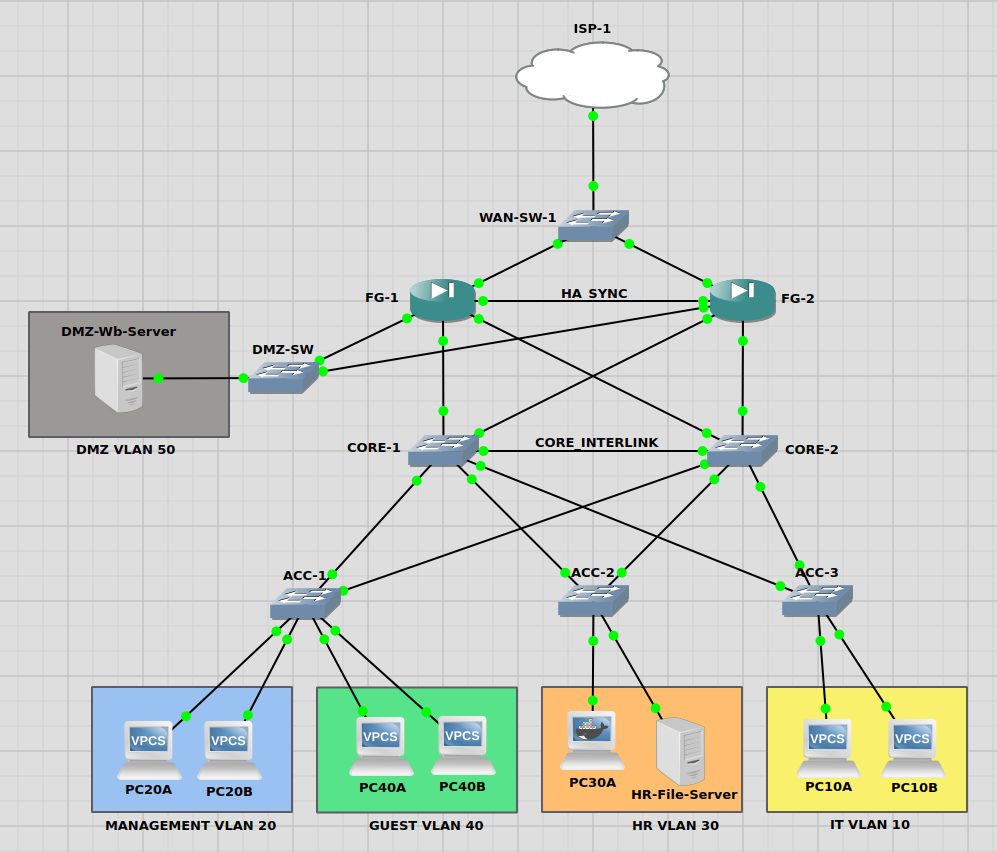

Here’s a tightened, more structured, and professional revision of your v3 DMZ/Perimeter Hardening doc. I’ve kept your content faithful but aligned it more with the style and clarity of v2, emphasizing goals, architecture, verification, and lessons learned.

---

# Campus Network – Perimeter Hardening & DMZ Service Isolation (v3)

## Executive Summary

v3 evolves the campus network from simple segmentation and redundancy (v2) into a **perimeter-hardened architecture** with strict service isolation.

Key objectives:

* Isolate public-facing services from internal infrastructure
* Enforce explicit trust boundaries via firewall zones
* Restrict sensitive internal resources (e.g., HR File Server)
* Implement deny-by-default inter-zone traffic posture
* Validate security posture through end-to-end testing

This phase demonstrates practical DMZ placement, VLAN segmentation, ACL enforcement, and firewall policy control.

---

## Architectural Model

1. **Perimeter Isolation:** Ensure DMZ hosts public services while protecting internal VLANs
2. **Lateral Movement Prevention:** Restrict cross-zone traffic to reduce attack surface
3. **Sensitive Resource Protection:** HR File Server accessible only to authorized internal VLANs
4. **Policy Enforcement:** Apply strict firewall rules and logging for inter-zone traffic
5. **Validation & Monitoring:** Confirm segmentation and access controls via structured testing

---

## Zone & VLAN Design

### Firewall Zones

| Zone          | VLANs          | Purpose                    |
| ------------- | -------------- | -------------------------- |
| ZONE_INTERNAL | 10, 20, 30, 40 | Internal users and servers |
| ZONE_DMZ      | 50             | Public-facing services     |
| ZONE_WAN      | N/A            | External network / ISP     |

### VLAN Breakdown

| VLAN | Role                   |
| ---- | ---------------------- |
| 10   | IT                     |
| 20   | Management             |
| 30   | HR (File Server)       |
| 40   | Guest                  |
| 50   | DMZ (Nginx Web Server) |

### Network Model

v3 follows a **hub-and-spoke security model**:

* Core switch performs inter-VLAN routing
* ACLs control internal access to sensitive VLANs
* FortiGate firewall enforces zone-to-zone policies
* DMZ connected via dedicated Layer 2 switch
* Default posture: deny unless explicitly allowed

Trust boundaries are enforced at the firewall, not the switch fabric.

---

## Service Placement Strategy

### DMZ – VLAN 50

* Hosts public Nginx web server
* Accessible from WAN via firewall policy
* No direct access to internal VLANs

### HR File Server – VLAN 30

* Located within ZONE_INTERNAL
* Accessible only from VLAN 10 (IT) and VLAN 20 (Management)
* Blocked from VLAN 40 (Guest), ZONE_DMZ, and WAN

Segmentation is VLAN-based, enforced with ACLs and firewall policies.

---

## Firewall Policy Model

| Source   | Destination | Action                   | Purpose                     |
| -------- | ----------- | ------------------------ | --------------------------- |
| WAN      | DMZ         | Allow (HTTP/HTTPS)       | Public web access           |
| WAN      | INTERNAL    | Deny                     | Protect internal assets     |
| INTERNAL | HR          | Allow (restricted VLANs) | Authorized access           |
| GUEST    | HR          | Deny                     | Prevent unauthorized access |
| DMZ      | INTERNAL    | Deny                     | Prevent lateral movement    |
| INTERNAL | WAN         | Allow (controlled)       | Internet access             |

> Implicit deny exists for all other traffic.

---

## Security Posture

* Strict inter-zone inspection with logging
* Clear separation between exposed and internal services
* Reduced blast radius in case of DMZ compromise
* Firewall prevents pivoting from DMZ to internal networks

---

## Verification & Testing

Tested scenarios:

| Test Case                      | Result              |
| ------------------------------ | ------------------- |
| WAN → DMZ (HTTP/HTTPS)         | ✅ Allowed           |
| WAN → INTERNAL                 | ✅ Blocked           |
| Guest VLAN → HR File Server    | ✅ Denied            |
| IT/Management → HR File Server | ✅ Allowed           |
| DMZ → INTERNAL                 | ✅ Denied            |
| Firewall Logs                  | ✅ Policies enforced |

All verification evidence stored in `verification/` directory.

---

## Key Changes from v2

* Added VLAN 30 (HR segment) and VLAN 50 (DMZ)
* Dedicated DMZ switch implemented
* Updated firewall zone policies and ACLs
* Public service exposure model added
* Default deny inter-zone policy enforced

---

## Lessons Learned

* Segmentation alone is insufficient without firewall enforcement
* Service exposure must be intentional and minimal
* Documented trust boundaries improve architecture clarity
* DMZ reduces internal attack surface effectively

---

## Summary

v3 demonstrates **practical perimeter hardening**:

* Public services isolated in DMZ
* Internal services protected
* Clear, enforceable trust boundaries
* End-to-end validation ensures policies operate as intended

This phase bridges segmentation and redundancy into a **secure, controlled, production-like network environment**.

---

